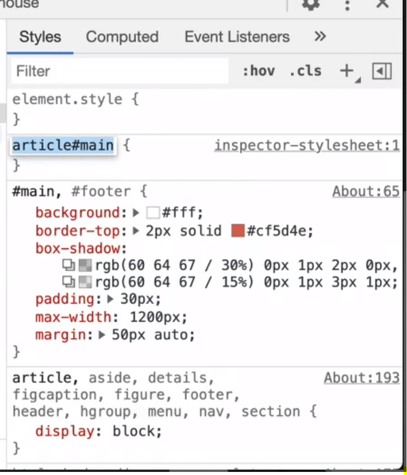
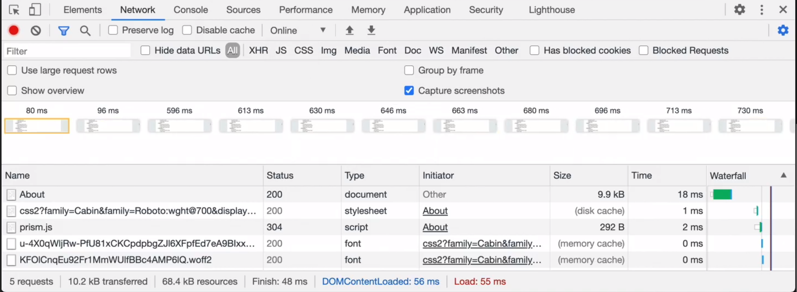
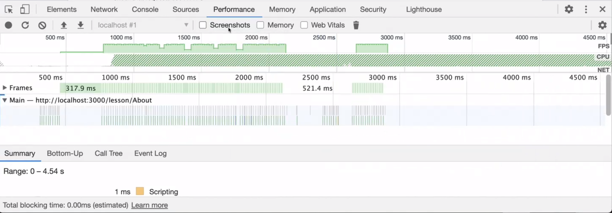
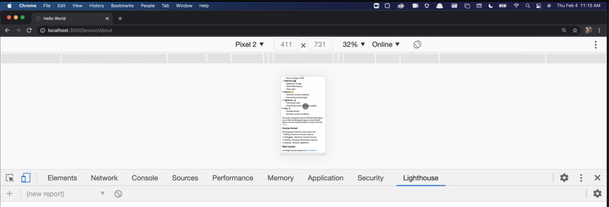
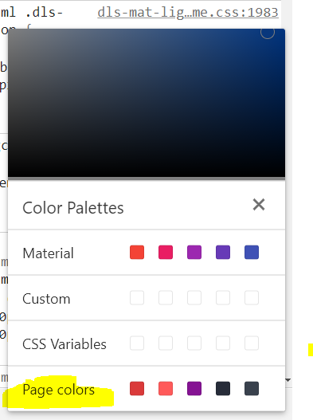

# Introduction to Dev Tools, v3

Note: If you're looking for Mastering Chrome Devtools, v2:

A web app for teaching people about Chrome DevTools. This is the website and course materials for the [Introduction to Dev Tools, v3](https://frontendmasters.com/workshops/dev-tools-v3/) on Frontend Masters.

## Requirements

This app requires Node.js which can be downloaded [here](https://nodejs.org/)

## How to use

```bash
git clone https://github.com/ankitbtanna/mastering-chrome-devtools.git
cd mastering-chrome-devtools
npm install
npm start
```

Then visit [http://localhost:3000](http://localhost:3000)

## If you'd like the app to automatically reload on changes

```bash
git clone https://github.com/ankitbtanna/mastering-chrome-devtools.git
cd mastering-chrome-devtools
npm install -g nodemon
npm install
nodemon server/server.js
```

Note: If you're looking for Mastering Chrome Devtools v2, run:

```
git clone https://github.com/ankitbtanna/mastering-chrome-devtools.git
cd mastering-chrome-devtools
git checkout v2
npm install
npm start
```

# Introduction
- Tips and tricks to be productive
- This course is a single repo
- Repo: mastering-chrome-devtools
- Clone, cd, npm install, npm start
- Best Resource: https://developers.google.com/web/tools/chrome-devtools/
- Wont necessarily find them in job applications
- Great tools for finding bugs quickly
    - console, step through debugger, css inspector
- Network requests, CPU requests, Memory: For web performance
- Find a really cool website, open dev tools and know how it runs
    - How animation happens, what css are they using...
- Not a lot of courses that teach dev tools
- Not a lot of courses that teach debugging

# Course Outline
- History of DevTools
- Walk through the panels
- Editing
- Debugging
- Network performance
- CPU performance
- Memory
- Auditing

## Introduction to Devtools
- Zero prior understanding to Chrome DevTools
- Open: Right Click ---> Inspect
- Open: Ctrl + Alt + C
- Earlier there was no Fully interactive DOM
    - HTML CSS dumped ---> View Page Source
- Previously when we had to check some value: we had to alert stuff
    - Its cool until people started forgetting it to remove
    - Cant alert Objects :D
    - JSON.stringify the object or for loop through the keys of object
- Ability to console the complex types
- Then came hixie live dom viewer
    - software.hixie.ch/utilities/js/live-dom-viewer/
- Firefox ---> Firebug (plugin)
    - Set a gold standard
    - giant change on how people did web development

## Who this course is made for
- Little to no experience for chrome dev tools
- Folks who are comfortable with Network and Console Panels
- Folks comfortable with all panels but need to learn tips and tricks for being productive

## What can DevTools do?
- Its important to know what a tool can do than knowing exactly how to do it
- Remember just what they can do
- Chrome Extensions often mess with DevTools data, leading to inaccurate reporting.
    - Either disable all extensions
    - Open Incognito
    - *Because Extensions can add new scripts, new network calls, etc...

## Panels
- A walk through Panels

### Elements Panel
- View HTML and CSS

- Click on an element
- Change the CSS/background
- You can edit the HTML as well
- CDT will edit the end tag automatically
- Change ID/Class
- Pretty much everything is double clickable
- You can add a new style 

- HTMLs are drag-dropable
- Pretty intuitive

### Network Panel
- When we load our page
- Shows stack of all requests sent
- Top one is always document (html)
- Resposnse is our file
- Looks for external resources
- html ---> CSS, html ---> JS, html ---> font, css ---> font/image
- Things we can see:
    - name of resource
    - status
    - type of the resource
    - who initiated it
    - size
    - time
- Server issues can be diagnosed from Network tabs
- At the bottom of the page: 
    - DOMContentLoaded
    - Load
    - These 2 times are important and especially in Lighthouse scores
- We can have Network Tab Capture Screenshots as well

- Able to inspect request and response data
- When API is not working, we are asked about the headers we are sending or receiving
- This comes in really handy when request has request ID and can be looked up in the logs

### Performance Panel
- People are scared of it
- Record - Interact - Stop
- Keep Recording small - 10-15s

- What the graphs indicate
    - FPS
    - CPU usage
    - Main thread
    - Frames
    - Rasterizing
    - GPU
- Look if 
    - page is jammed
    - whats causing the page to lag
    - whats the memory usage
    - Whats my CPU usage
- Come with a specific question to this panel

### Console Panel
- Can console different types of data
- Go To Elements Tab. Click on element. That element is assigned to $0
- type $0 in console, you get reference to that element
    - All element functions are available to access them

### Security Panel
- Defacto standard: https
- Resources serving over http
- open and you see green then its good
- if its orange or red then there's a problem

### Sources Panel
- Call Stack
- Watch a variable
- Workspaces
- Drag our project to workspace and we can save it to disk

### Application Panel
- Storage
- Cookies
- Index DB
- Service Workers
- Storage > Clear Site Data

### Memory Panel
- Heap Snapshot - How memory is being used in our app
- Timeline - JS memory allocation over time
- Allocation Sampling - What JS code is causing it

### Lighthouse Panel
- Opensource
- First Paint Time
- PWA - offline
- Accessibility
- SEO

### Devices Panel
- Responsive web development


### Element Finder
- Click on element finder and target any element

### Settings, experiments

- We will spend a lot of time in each panel
- We can connect android device which can be connected and tested
- Good instead of emulator it would be perfect

### Theme of Course
- Editing - Elements, Console, Sources
- Debugging - Elements, Console, Sources
- Profiling - Network, Performance, Memory
- Auditing - Network, Lighthouse

## Editing Websites
- We will be doing 3 things
    - Quick Edits
    - Edit in Chrome
    - Save to disk within chrome

- (⚡️ indicates a tip or trick!)
- Editing CSS
- Adding CSS Rules
- Editing HTML
- ⚡️ Scroll into view - right click element and scroll into view (infinite scrolling apps)
- Console shortcuts - $0, $1(previous element) it keeps history
- Hide and show elements - select element, press "h" to hide or show the element, right click delete the element
- Simulate state - Style > hov, active, etc
- ⚡️ Computed styles - Final styles... sequential application of styles... All divs are blue, div with class foo is red. Shows the final applied style
- ⚡️ HTML breakpoints ---> Right click: Break On: Sub Tree Modifications, attribute modification, node removal. Show me which JS modified. Go to call stack on the right hand side it shows which JS is modifying it.
- Find event listeners - Click on button, right side there is Event listeners tab
- ⚡️ Changing color formats - Can see colours on page, shift click to change from hex ---> hsa, rgb

- ⚡️ Import custom theme
- CSS Specificity
- Accessible color picker
- Accessibility panel - has accessibility panel which shows if element is part of tab index, has aria attributes or not
