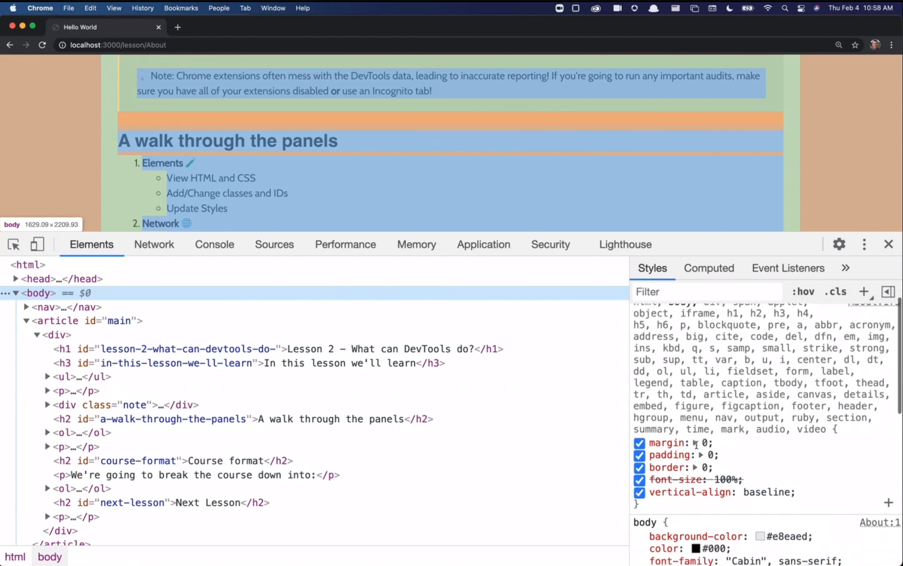

# Introduction to Dev Tools, v3

Note: If you're looking for Mastering Chrome Devtools, v2:

A web app for teaching people about Chrome DevTools. This is the website and course materials for the [Introduction to Dev Tools, v3](https://frontendmasters.com/workshops/dev-tools-v3/) on Frontend Masters.

## Requirements

This app requires Node.js which can be downloaded [here](https://nodejs.org/)

## How to use

```bash
git clone https://github.com/ankitbtanna/mastering-chrome-devtools.git
cd mastering-chrome-devtools
npm install
npm start
```

Then visit [http://localhost:3000](http://localhost:3000)

## If you'd like the app to automatically reload on changes

```bash
git clone https://github.com/ankitbtanna/mastering-chrome-devtools.git
cd mastering-chrome-devtools
npm install -g nodemon
npm install
nodemon server/server.js
```

Note: If you're looking for Mastering Chrome Devtools v2, run:

```
git clone https://github.com/ankitbtanna/mastering-chrome-devtools.git
cd mastering-chrome-devtools
git checkout v2
npm install
npm start
```

# Introduction
- Tips and tricks to be productive
- This course is a single repo
- Repo: mastering-chrome-devtools
- Clone, cd, npm install, npm start
- Best Resource: https://developers.google.com/web/tools/chrome-devtools/
- Wont necessarily find them in job applications
- Great tools for finding bugs quickly
    - console, step through debugger, css inspector
- Network requests, CPU requests, Memory: For web performance
- Find a really cool website, open dev tools and know how it runs
    - How animation happens, what css are they using...
- Not a lot of courses that teach dev tools
- Not a lot of courses that teach debugging

# Course Outline
- History of DevTools
- Walk through the panels
- Editing
- Debugging
- Network performance
- CPU performance
- Memory
- Auditing

## Introduction to Devtools
- Zero prior understanding to Chrome DevTools
- Open: Right Click ---> Inspect
- Open: Ctrl + Alt + C
- Earlier there was no Fully interactive DOM
    - HTML CSS dumped ---> View Page Source
- Previously when we had to check some value: we had to alert stuff
    - Its cool until people started forgetting it to remove
    - Cant alert Objects :D
    - JSON.stringify the object or for loop through the keys of object
- Ability to console the complex types
- Then came hixie live dom viewer
    - software.hixie.ch/utilities/js/live-dom-viewer/
- Firefox ---> Firebug (plugin)
    - Set a gold standard
    - giant change on how people did web development

## Who this course is made for
- Little to no experience for chrome dev tools
- Folks who are comfortable with Network and Console Panels
- Folks comfortable with all panels but need to learn tips and tricks for being productive

## What can DevTools do?
- Its important to know what a tool can do than knowing exactly how to do it
- Remember just what they can do
- Chrome Extensions often mess with DevTools data, leading to inaccurate reporting.
    - Either disable all extensions
    - Open Incognito
    - *Because Extensions can add new scripts, new network calls, etc...

## Panels
- A walk through Panels

### Elements Panel
- View HTML and CSS
